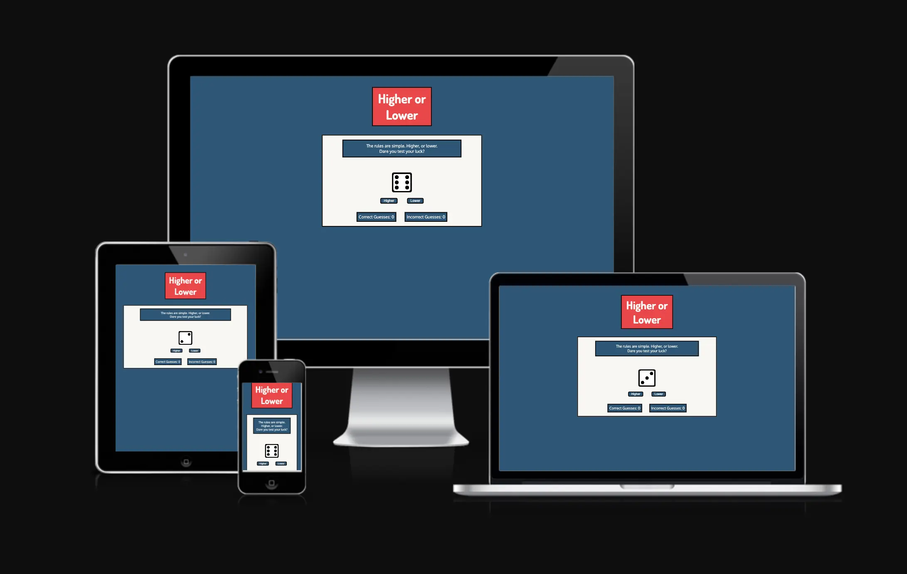
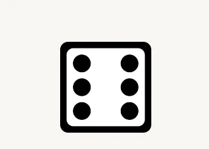
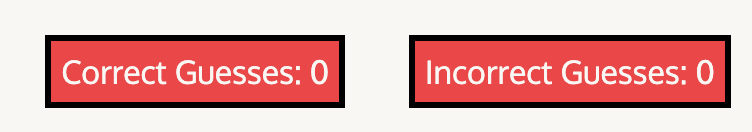
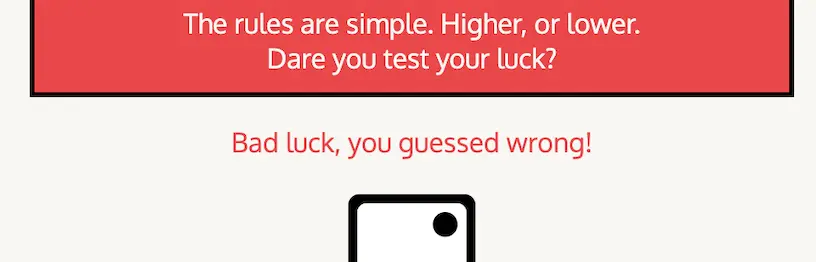
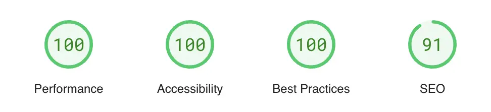

# Introduction
# Higher or Lower
### Introduction - A game to test your luck, if you dare? Is the next roll of the dice higher or lower? Only you know that, so take the plunge and put your luck on the line...

### Project Purpose - This project is designed to be an engaging and interactive experience, putting the user's luck up against the device they are playing it on, be it mobile or computer screen. 

# Features 

**Rules Box**

  - This feature quickly explains how the game works, quickly giving the users all the information required to interact with the page.

  

Rules Box Screenshot

  

  

 

**Dice Image**

 - This feature uses JavaScript to update the dice area DIV with an image of a die that correlates to the number randomly created by the rollDice() function.

  - It rolls automatically upon site load and has an animation that creates the look of a die rolling.

  - More engaging and better visually than just a number appearing. 
  

  

Dice Screenshot

  

  

 

**Higher or Lower function**

  - The main area of user interaction on the page. The user either selects the higher or lower button, depending on the current number on the die.

  - The game then rolls another dice and will inform you if you were correct or incorrect.

  

Higher or Lower Screenshot

  

  

 

**Scoreboard Feature**

  - A dynamically changing score counter that either increases correct or incorrect guesses depending on if the user was correct or incorrect.

  - A fun bit of engagement for the user to try and keep their correct score higher than their incorrect score.

  

Scoreboard Screenshot

  

  

 

**Message Feature**

  - This feature displays a message on the screen in the game area, giving the user a congratulation or a better luck next time message, depending on if their guess was correct or incorrect.

  - Also has a message that flashes if the new number rolled was the same as the previous. This doesn't count as a right or wrong and instead asks the user to roll again.

  

Message Screenshot

  

  

 

## Future Features
While the current version of the project is fully functional, I have some features planned for future updates that I would like to implement:

1. **Difficulty Choice**:
   - Adding a d10 (ten sided dice) and a d20 (twenty sided dice) to the page that the user can select. Each dice representing a difficulty spike. d6 = easy, d10 = medium, d20 = hard.
2. **Rolling Animations**:
   - Add the rolling animation to every dice roll, not just the first one of the page load.
3. **Sound effects**:
   - Add dice rolling sound effects when the dice roll onto the screen. Further increasing the fun and engagement of the game.
4. **Optional game mode**:
   - Add an optional game mode where you click a button to activate it, but if you get a guess wrong, the game resets. A game mode designed to see how long you can go for.

## Manual Testing 

#### Features Testing

|  Feature |  Action | Effect |
|---|---|---|
|Higher Button|Click|Rolls dice and checks to see if the new number is higher than the previous. If so, increments correct score.|
|Lower Button|Click|Rolls dice and checks to see if the new number is lower than the previous. If so, increments incorrect score.|

#### Lighthouse

**Introduction**
This report presents the results of Lighthouse testing conducted to assess the performance, accessibility, best practices, SEO, and PWA compliance of Higher or Lower.

**Test Execution**
Lighthouse tests were executed using the Brave's browser's DevTools.

**Test Metrics**
- Performance Score: 100
- Accessibility Score: 100
- Best Practices Score: 100
- SEO Score: 91

**Detailed Results**
- **Performance**: The website's performance score is 100, indicating good overall performance.
- **Accessibility**: The website excels in accessibility, with a score of 100, indicating strong adherence to accessibility standards.
- **Best Practices**: The website follows best practices with a score of 100.
- **SEO**: SEO performance is strong, with a score of 91. The website has well-optimized meta tags and structured data markup.

**Visuals**

#### Browsers

**Supported Browsers and Devices**
Our web application is officially tested and supported on the following browsers and devices:
- Brave (latest version)
- Google Chrome (latest version)
- Mozilla Firefox (latest version)
- Safari (latest version)

**Responsiveness Testing**

We conduct manual responsiveness testing on Chrome and Firefox to ensure a seamless user experience.

**Test Results**

| Device/Screen Size  | Chrome Performance | Firefox Performance |
|----------------------|--------------------|---------------------|
| Desktop (1920x1080) | Perfect performance, no issues noticed on Chrome | Perfect performance, no issues noticed on Firefox |
| Laptop (1366x768)   | Perfect performance, no issues noticed on Chrome | Perfect performance, no issues noticed on Firefox |
| Tablet (iPad)       | Perfect performance, no issues noticed on Chrome | Perfect performance, no issues noticed on Firefox |
| Mobile (iPhone X)   | Perfect performance, no issues noticed on Chrome | Perfect performance, no issues noticed on Firefox |

**Recommendations**

If you encounter any responsiveness issues, we recommend:
- Updating your browser to the latest version.
- Trying an alternative device or screen size for optimal viewing.

#### Screen Sizes testing

**Introduction**
- This section provides an overview of how our web application [Website Name] performs across different screen sizes.

**Supported Screen Sizes**
- Our web application is designed to be responsive and adapt to various screen sizes. Below are the screen sizes we have tested:

| Screen Size     | Description             |
|-----------------|-------------------------|
| Laptop (L)        | 1440x1080 pixels        |
| Laptop          | 1024x768 pixels         |
| Tablet (iPad)   | 768x1024 pixels (portrait) and 1024x768 pixels (landscape) |
| Mobile (iPhone) | 320x812 pixels (portrait) and 819x375 pixels (landscape) |

**Testing Results**

| Screen Size     | Test Results           |
|-----------------|------------------------|
| Desktop         | Perfect performance and no loading issues acorss Google chrome, Brave, Firefox and Safari. |
| Laptop          | Perfect performance and no loading issues acorss Google chrome, Brave, Firefox and Safari. |
| Tablet (iPad)   | Perfect performance and no loading issues acorss Google chrome, Brave, Firefox and Safari. |
| Mobile (iPhone) | Perfect performance and no loading issues acorss Google chrome, Brave, Firefox and Safari. |

 

#### Bugs Resolved

**Introduction**

This section provides a summary of bugs that have been identified, reported, and subsequently resolved in [Website Name].

**Bug Tracking**

Below is a summary of resolved bugs:

| Bug ID | Bug Description | Status |
|--------|-----------------|--------|
| #001   | When trying to create the higher and lower function, the new number that was generated from these functions weren't being stored in the global variable created to store the current number. So once the page loaded and generated the first number, every higher or lower choice after was being compared to that original value, not the new one being created. | Resolved |

**Bug Details**

Here are the details of the resolved bugs:

**Bug #001**
- **Resolution**: Noticed that in my selectedUserChoice function, I had misspelled the variable name currentRoll, which is the global variable where the current roll (number) is stored. 
- This function rolls a new dice and then changes the value of currentRoll with newResult. However, due to the misspelling, the value of currentRoll wasn't being changed.
- **Impact**: As the main game loop is to guess if the current number is higher or lower, this bug completely destroyed that loop by not updating the number, which caused the game to not work.

#### Bugs Unresolved(if applicable)

| Bug ID | Bug Description | Status |
|--------|-----------------|--------|
| #001   | I have created a function that displays a message detailing to the user whether their guess was correct or incorrect. This was enhanced by using a setTimeout method that will display the message for 2 seconds before disappearing. However, if you click higher or lower whilst this message is still displayed, it bugs out and the next message that appears will only last a split second. The next time you click higher or lower, though, the setTimeout method works as intended. Whilst not a game breaking bug, it is a visual bug that stops the user from seeing the message if they rapidly push higher or lower. | Unresolved |

#### Validator Testing 
- HTML
  - No errors were returned when passing through the official [W3C validator](https://validator.w3.org/)
- CSS
  - No errors were found when passing through the official [(Jigsaw) validator](https://jigsaw.w3.org/css-validator/)
- JavaScript
  - No errors or warnings were found passing through [JSHint](https://jshint.com/)

## Deployment

This section should describe the process you went through to deploy the project to a hosting platform (e.g. GitHub) 

- The site was deployed to GitHub pages. The steps to deploy are as follows: 
  - In the GitHub repository, navigate to the Settings tab 
  - From the source section drop-down menu, select the Main Branch
  - Once the main branch has been selected, the page will be automatically refreshed with a detailed ribbon display to indicate the successful deployment. 

The live link can be found here - https://thom52.github.io/Higher-or-Lower/

## Credits 

#### Content 

- The fonts for the heading and p elements were taken from [Google Fonts](https://fonts.google.com/)

- The favicon was taken from [Flat Icon](https://www.flaticon.com/)

- The dice face icons were taken from [Game Icons](https://game-icons.net/) a great project built to provide users with an ever growing library of game icons to use in your projects.

- The scoreboard feature was inspired by the Love Math project created by [Code Institute](https://learn.codeinstitute.net/courses/course-v1:CodeInstitute+LM101+3/courseware/2d651bf3f23e48aeb9b9218871912b2e/234519d86b76411aa181e76a55dabe70/)

